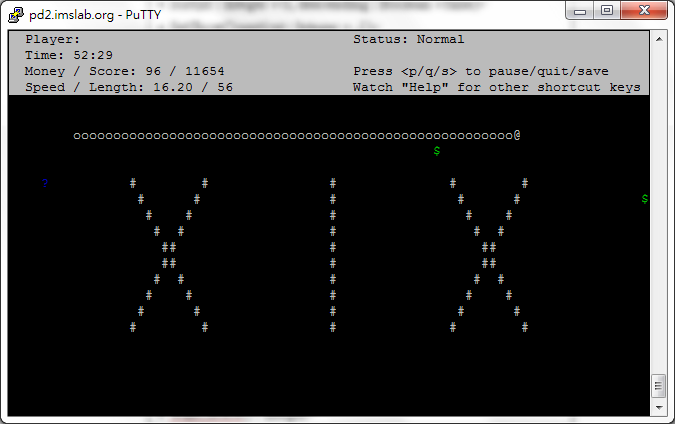
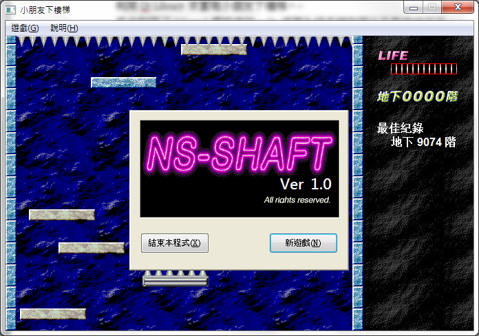

# CppCourse
Homework of NCKU Program Design (II)

#### Homework 1
* Basic practice for C++ Class

#### Homework 2
* Sudoku Solver and Generator

#### Project 1
* SnakeGame, made with ncurses

#### Project 2
* ShaftGame, made with Qt5

